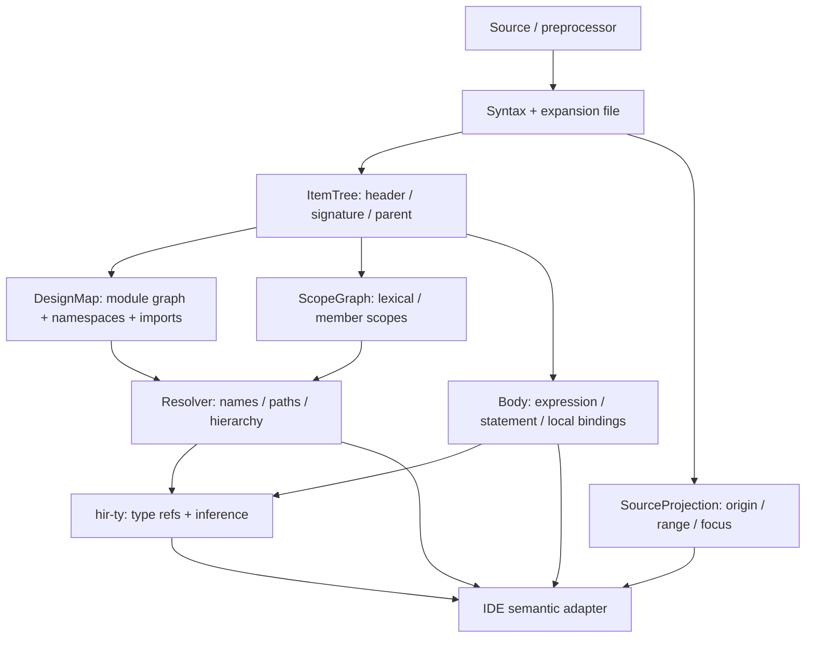

# hir-def 重构研究：从容器化 lowering 到可维护语义模型

> 研究日期：2026-08-06
>
> 本文基于当前 vide 代码、rust-analyzer 官方架构/源码、clangd 官方设计文档、gopls 官方设计文档和 LSP 规范。它不是局部修补计划：结论是替换 hir-def 的核心语义模型，而不是继续给现有 `DefId`、`NameScope` 和各类 container 加特判。

## 0. 结论先行

**根因不是代码风格差，而是语义层次选错了。** 当前 hir-def 把“某个 AST 节点在某个物理容器中的 lowered 数据”当成主要模型；但 IDE 需要的是“稳定的逻辑定义、作用域图、解析结果和源码投影”。于是四类本应独立的问题被压进一套容器化 arena：

1. **语义身份**：`DefId`、`DefOrigin`、非 ANSI port 的多个声明形态；
2. **结构 lowering**：文件、module、generate block、block、subroutine 各自的 arena；
3. **名称解析**：scope 构造、namespace、import、hierarchical path；
4. **源码投影**：AST pointer、range、focus range、宏/包含文件映射。

这些问题没有清晰的深模块（deep module）接口，复杂度泄漏到 `hir-ty`、`hir-semantics` 和 `ide`。`ide/src/semantic_index/build.rs` 甚至必须手工复刻 container 发现和 scope chain 缓存，说明当前 seam 放错了：调用者在补 hir-def 的内部设计。

**正确方向：** 引入类似 rust-analyzer 的四层内部模型，但按 SystemVerilog 语义重做，而不是复制 Rust 术语：



最终的 hir-def 公共接口应当是少量、语义化、可测试的模块接口：

- `item_tree(file)`：文件级结构摘要和 item identity；
- `design_map(profile)`：设计单元/module/package 图与跨文件声明；
- `scope(scope_id)` / `resolve(...)`：名称空间与解析；
- `body(body_id)`：函数、过程、初始化器等 body；
- `source(def/origin)`：逻辑定义到一个或多个源码 origin 的投影；
- `diagnostics(owner)`：typed lowering/resolution diagnostics。

原始 arena、container enum、source-map 双向表、`NameScope` 内部 map 必须降为 implementation，不再成为 IDE 的调用接口。

---

## 1. 当前实现的真实形状

### 1.1 现有层次

当前依赖方向本身是合理的：

```text
base-db (Salsa inputs)
  -> preproc-expand (parse / preprocessing / compilation profile)
    -> hir-def (lowered HIR / source map / scope / name resolution)
      -> hir-ty (type system / inference)
        -> hir-semantics + ide
```

`base-db/src/source_db.rs` 把源文本、文件集合、source root、工程配置作为 Salsa 输入，derived preprocessing/lowering/type 数据放在更高层；这是正确的输入 seam。`preproc-expand/src/db.rs` 也明确把 preprocessing/compilation/parse 放在第一层语义数据库。问题集中在 hir-def 内部：它没有把“结构摘要”“声明图”“body”“源码投影”拆开。

### 1.2 结构上的证据

#### A. 文件和 module 是平面大容器

- `crates/hir-def/src/file.rs:52-73` 的 `HirFile` 同时持有 module、procedure、typedef、checker、covergroup、subroutine、declaration、expression、statement 等约 20 类 arena。
- `crates/hir-def/src/module.rs:74-105` 的 `Module` 同时持有约 30 类 arena；`ModuleSourceMap` 在 `:138-168` 再镜像几乎全部 arena。
- `module.rs:203-234`、`file.rs:149-170` 通过宏为每个 arena 生成 getter；`container.rs:466-574` 再通过 `Container` enum 为 File/Module/GenerateBlock/Block/Subroutine 重复 dispatch。

这不是普通的“类型多”。它意味着新增一个语义 item 往往必须同时修改：owner 数据、owner source map、getter 宏、container dispatch、item enum、scope builder、source projection 和 IDE 消费者。接口浅，内部复杂度没有被隐藏。

#### B. 同一个语义层被复制到五种 owner

`crates/hir-def/src/lower.rs:33-61` 定义 File/Module/GenerateBlock/Block/Subroutine 五种 store；`lower.rs:63-213` 为每个 store 重复实现 expression、event expression、declarator、statement、declaration 五组访问。`ProcStore`、`CheckerStore`、`ModuleItemStore` 又继续叠加能力组合。

这说明当前的抽象 seam 是“哪个容器有哪几个 arena”，而不是“哪个 semantic owner 有一个 body/signature”。这是典型的 shallow module：调用者学习大量 storage shape，却没有获得一个稳定的语义能力。

#### C. 语义身份在 lowering 之后补丁式合并

`crates/hir-def/src/symbol.rs:32-74` 使用进程级 append-only `origin_pool`；`DefOriginLoc` 在 `:99-123` 穷举 Module、Decl、Typedef、Instance、Port、Checker、Covergroup 等所有来源形态。`DefId` 实际上是一个 `OriginId`：

- `def_id.rs:550-562` 由 origin 创建 DefId；
- `def_id.rs:564-602` 运行时合成 additional origins；
- `def_id.rs:626-705` 通过“同名 + role 计数 + 非 ANSI label”扫描 module arena，决定多个源节点是否是同一个 port。

非 ANSI port 的逻辑身份没有在 item discovery 时建立，而是先得到 header port 和 declaration，再由 `DefId::new` 试图 canonicalize。这使 identity 依赖当前 database 中的 arena 内容和扫描规则；同一套扫描还被 `kind/name/source/declaration_origin` 反复解释。

#### D. scope 是手工枚举、隐式排序的副产品

`crates/hir-def/src/nameres.rs:22-45` 用单一 `scope_for(ScopeId, ())` tracked query 分派到八类 builder；实际 builder 在 `scope.rs:230-566` 手工枚举各个 arena。

`NameScope` 在 `symbol.rs:363-369` 直接暴露 `types/values/assertions/imports`；`symbol.rs:519-653` 的插入和 listing 逻辑依赖 map + `SmallVec` 的遍历/插入顺序。`scope.rs:68-83` 的注释已经承认插入顺序是行为的一部分；`module.rs:406-425` 的 `ModuleItem` 和 `source_map.items` 是跨 arena 保留 source order 的唯一线索。

`container.rs:748-778` 的 `ScopeParent` 通过 enum match 隐式产生 innermost-to-outermost 顺序；`pathres.rs:32-50` 再把这条链、imports、unit scope 和 top-level module fallback 串起来。算法并非没有测试，问题是 precedence/ordering 没有成为数据模型中的显式值。

#### E. IDE 在补偿 hir-def 的 seam

`crates/ide/src/semantic_index/build.rs:236-344` 自己实现 `ContainerCache` 和 `ScopeChainCache`：

- token walk 时沿 syntax ancestors 找最近 container；
- 手工镜像 semantics 的 `container_to_def` dispatch；
- 预取 `ScopeParent`、每个 `scope_for` 结果和 unit scope；
- 避免每个 token 重复触发 scope query。

这不是单纯的性能优化，而是接口证据：如果 hir-def 提供了“按 source token 找 semantic owner”和“按 owner 得到 immutable scope chain”的深接口，IDE 不应该知道 container 节点种类和 Salsa memo 失效细节。

#### F. 错误不是一等结果

`crates/hir-def/src/lower.rs` 的 `LoweringDiagnostic` 已存入各 owner 的 source map，并由 `diagnostics::file_lowering_diagnostics` 聚合成查询结果、`crates/ide` 转成编辑器诊断（`range: None` 有显示定位策略，unsupported → Warning，invalid 与 slang parse 诊断去重后按 Note 兜底）；`tracing::warn!` 只剩 instrumentation 作用。但 `Lowered<T>` 仍没有 typed diagnostics（owner/source/code/severity 是 IDE 侧拼出来的）。代码中还存在多种静默降级：

- `expr.rs:291-295` 无法 lower 时写入 `Expr::Invalid`；
- `expr/data_ty.rs:116-119` 对 struct/type-reference/virtual-interface 直接返回默认 data type；
- `expr/data_ty.rs:136-145` 将 named type 变为 expression；
- `module.rs` 的 member match 有大量 `continue`；
- `pathres.rs` / `hir-ty/src/infer.rs` 在 unresolved/ambiguous 时最终常规化为 `Unknown`。

IDE 看到的结果可能是 partial HIR、默认类型、空 scope 或 Unknown，但没有统一的“recoverable error + provenance”契约。维护者无法仅通过接口知道哪些情况是语法缺失、未实现、宏 source 不可映射，哪些情况是真正的 unresolved。

#### G. source identity 与 semantic identity 混合

`source_map.rs:22-118` 把 data 和 source map 包在一个 `Lowered<T>` 中；`source_map.rs:290-352` 的 `SourceMap` 是单个 source key 到单个 arena index 的双向表。对普通 AST 节点很好，但逻辑 definition 本身可能有多个 origins；因此 `DefId` 只好另行合成 `origins()`。

`source_map.rs:360-415` 对没有 root-buffer range 的 macro/include 节点允许 HIR allocation 但不生成 source-map entry，这个策略本身正确；缺点是“没有 source location”和“没有 lower 结果”仍通过大量 `Option` 传播，未在 semantic model 中显式区分。

---

## 2. slop 的结构性根因

### 根因 1：没有 canonical item/definition layer

当前第一等对象是 `HirFile`、`Module`、`Block` 等 physical owner；IDE 第一等对象却是 definition、reference、member、scope。缺少 canonical item layer 后：

```text
AST node
  -> owner-specific arena index
  -> DefOriginLoc variant
  -> DefId origin_pool
  -> additional_origins scan
  -> NameScope bucket
  -> IDE-specific source/definition group
```

同一逻辑定义要穿过五套 identity 规则。non-ANSI port 只是最明显的例子，instance target、subroutine port、checker/covergroup、generated block 都暴露同类问题。

### 根因 2：结构、语义、源码投影和 body 没有隔离

一个 module lower 同时处理：

- header/name/kind；
- ports/decls/typedefs/instances；
- expressions/types/statements；
- source order/region tree/source map。

即使 subroutine body 已经延迟，父容器仍需要复制 skeleton 并共享不属于同一 owner 的 type/expression ID。结果是“延迟 query”减少了首次工作，却没有获得清晰的 invalidation barrier。

### 根因 3：增量粒度错位

当前 Salsa query 的主要 key 是 `HirFileId`、`ModuleId`、`BlockId`、`SubroutineScope`；这些是 storage/container 粒度，而不是 header/body/definition 粒度。

因此：

- body edit 可能让整个 file/module 的 lowering 重新走一遍；
- scope 依赖 container lowering；
- import resolution 访问 scope 时再触发 database query；
- IDE 只能自己做 chain cache。

r-a 的核心不变量是“函数 body 内的修改不应使 `bar` 的全局 derived data 失效”；vide 当前没有同等级的显式不变量。

### 根因 4：错误被压成默认值/空值/日志

恢复能力是 IDE 必须拥有的能力，不是 lowering 的副作用。当前 `Option`、`Invalid`、默认 data type、`Unknown`、`continue`、`tracing::warn` 混在一起，导致：

- 调用者不知道何时可以继续；
- 类型系统无法区分 unresolved 与 unsupported；
- diagnostics 不能稳定定位根因；
- 维护者只能沿调用链猜测某个 `None` 的来源。

### 根因 5：顺序是隐式副作用，不是语义数据

当前行为依赖：AST 遍历顺序、arena index、`SmallVec` 位置、map 遍历顺序和 insertion order。SystemVerilog 的 positional port/parameter、本地 declaration precedence、package import precedence 都需要确定性规则；但模型没有 `SourceOrder`、`Precedence`、`Namespace`、`BindingOrigin` 这些显式概念。

### 根因 6：内部接口被当作公共接口使用

`hir-def/src/lib.rs:1-35` 的模块注释称它是 ECS-style definition implementation、显式 workspace-internal interface；但同文件 `:12-35` 将大量实现模块 `pub`，`NameScope` 字段也是 public，`hir-ty`、`hir-semantics`、`ide` 直接依赖 raw IDs 和 source maps。

这形成了最差的中间态：既没有 r-a 那样明确的“internal-only” discipline，也没有一个对上层负责的稳定语义 facade。改动一次要迁移所有泄漏的调用者，维护者也无法判断什么是 contract、什么是 incidental representation。

---

## 3. 外部系统对比：应该学什么，不应该照搬什么

### 3.1 rust-analyzer：最接近的参照物

rust-analyzer 官方架构文档把 `hir-expand`、`hir-def`、`hir-ty` 称为 compiler brain，并明确指出：这些 crate 是 raw ID + database query 的内部实现，不是 API boundary；`hir` 和 `ide` 才是对外 seam。

关键设计：

1. **ItemTree**
   - 官方源码 `crates/hir-def/src/item_tree.rs`：ItemTree 是简化 AST，只保留 item；按 `HirFileId` 建立；没有 name resolution。
   - 官方注释明确把 ItemTree 作为增量 invalidation barrier：修改函数体通常不影响文件 item tree，因此不重新计算 name resolution/item data。
   - ItemTree 保留 `AstId` 以映射回 surface syntax，不把完整 syntax tree 和 semantic info 混在一起。

2. **DefMap**
   - 官方源码 `crates/hir-def/src/nameres.rs`：DefMap 保存 crate module tree 和每个 module 的 visible items。
   - name resolution 被拆成 raw item collection、module collection、import resolution、macro resolution 等相互递归阶段；imports 不是每个调用点的 ad-hoc fallback。
   - `ItemScope` 独立描述 scope 内 declaration/import/resolution state。

3. **PerNs**
   - 官方源码 `crates/hir-def/src/per_ns.rs`：同名的 type/value/macro 是可并存的不同 namespace，`PerNs` 明确承载三者。
   - 这比 vide 当前 `NameContext` + 三个 map + `iter_listing` 更清晰，因为 namespace presence/value/import provenance 是一个值。

4. **Body/ExpressionStore**
   - 官方源码 `crates/hir-def/src/expr_store.rs`：item body 独立存储 expression/pattern/binding/type refs 和 source map。
   - body 与 item/header 分离，type refs 不是用普通 expression 伪装。

5. **Source seam**
   - 官方源码 `crates/hir-def/src/src.rs`：`HasSource` 和 `HasChildSource` 作为从 HIR 到 AST 的投影接口；raw HIR implementation 不要求调用者手工枚举 container。

**适合 vide 的原则：** ItemTree / DefMap / Body / Source Projection 四分法，raw IDs 只留在内部，明确 API boundary，增量不变量先于 feature 数量。

**不能直接复制：** Rust 的 crate/module/macro/visibility/edition 规则、`PerNs` 的三 namespace 数量和宏 expansion phases。Vide 应保留 SystemVerilog 的 type/value/assertion/hierarchical/package/import 语义，并把 module instance elaboration 作为显式阶段，而不是假装是 Rust module。

### 3.2 clangd：动态 AST 与全局索引分层

clangd 官方设计文档 `https://clangd.llvm.org/design/` 和 `.../design/indexing` 给出另一种可迁移的原则：

- 每个 open file 有自己的 AST worker，由 `TUScheduler` 管理；请求在 file-local AST 上完成。
- 全局 `SymbolIndex` 是独立接口；`SymbolID` 合并同一逻辑 symbol 的 declaration/definition，`Ref` 是 symbol 到源码位置的边。
- `FileIndex` 是动态顶层，保证当前编辑文件结果新鲜；`BackgroundIndex` 提供完整项目覆盖；多个 index 通过 `MergedIndex` 对 feature 隐藏组合细节。

**适合 vide 的原则：** 当前文件的即时语义和跨设计 unit 的 workspace index 需要分开；definition identity 与 declaration/reference locations 需要分开；IDE feature 不应该知道 index 由几层组成。

**不能直接复制：** C/C++ 的 translation unit AST、compile command 和后台线程模型。SV 的 preprocessing/compilation profile、module instance hierarchy、macro/include source mapping 不同；先建立正确的 DefMap/ScopeGraph，再决定是否需要 background index。

### 3.3 gopls：明确面对 file/package invalidation 的代价

gopls 官方设计文档 `https://raw.githubusercontent.com/golang/tools/master/gopls/doc/design/design.md` 说明：

- gopls 是长生命周期进程，缓存和预计算服务于低延迟 IDE 请求；
- 编译器的 package 粒度与编辑器的 file 粒度不一致，修改文件可能改变 package membership，因此 cache invalidation 是核心难题；
- 目标是让连续 typing 的反馈通常在 100ms 内，同时强调 decoupling、测试故事和可贡献性；
- 后续采用 memory cache + on-disk index 的混合策略来应对 workspace 规模。

**适合 vide 的原则：** 先定义 edit-to-query 的 invalidation matrix，再选 Salsa query 粒度；“用了 Salsa”不等于增量边界正确。对于 vide，至少要分 structural header、cross-file design map、body、source location 四种粒度。

**不能直接复制：** gopls 的 package/type-checking 作为核心粒度。SystemVerilog 的 module/package/instance/compile profile 组合不同；如果把整个 compilation unit 或整个 module 作为唯一缓存 key，仍会得到现在的错位。

### 3.4 LSP：协议边界不是语义模型

LSP 3.17 规范规定 document synchronization、request lifecycle 和 feature payload，但不规定 HIR、name resolution 或 incremental database 的内部形状。`docs/lsp/README.md` 已经把协议 runtime 与 `GlobalStateSnapshot` 分开；hir-def 不应为了 LSP JSON 设计内部数据结构，也不应让 raw HIR 类型穿透到 runtime。

---

## 4. 目标架构

### 4.1 模块与 seam

按 deep module 原则，目标模块应让调用者学习少量接口，而不是学习 storage representation：

| 模块 | Interface | Implementation 隐藏内容 | 增量 key |
|---|---|---|---|
| `syntax` | `SyntaxTree`, AST nodes, parse diagnostics | parser/tree representation | `HirFileId` |
| `item_tree` | `FileItems`, `ItemHeader`, `ItemId`, `SourceAstId` | AST traversal、header lowering、owner allocation | `HirFileId` + structural input |
| `design_map` | `DesignMap`, `ModuleDef`, `PackageDef`, module/package lookup | file aggregation、duplicate handling、profile roots | `CompilationProfileId` |
| `scope_graph` | `ScopeId`, `Binding`, `lookup`, `members` | namespace maps、import fixed point、precedence | owner/item signatures |
| `resolver` | `resolve_name`, `resolve_path`, `Resolution<T>` | lexical/import/hierarchy algorithm | map + query args |
| `body` | `Body`, `ExprId`, `PatId`, `TypeRefId`, body source | per-owner expression lowering, local scopes | `BodyOwnerId` |
| `source` | `source(def)`, `origins(def)`, `semantic_target(file, offset)` | pointers, ranges, macro/include projection | source revision |
| `diagnostics` | typed diagnostics with owner/source/provenance | recovery bookkeeping | owner query |
| `hir-ty` | `type_of(def/expr)`, `members(def)` | normalization/inference | resolver + body |
| `ide` | POD navigation/completion/reference results | semantic adapter and LSP view conversion | request + immutable snapshot |

`hir-def` 的 raw IDs 和 arena 仍可存在，但它们属于 implementation；只有 `ItemId/DefId/ScopeId/BodyId` 这类语义 identity 通过接口出现。

### 4.2 ItemTree：稳定结构摘要

`ItemTree` 是第一处真正的 seam。它应按 `HirFileId` 建立，至少包含：

```rust
struct FileItems {
    root: OwnerId,
    items: Box<[ItemId]>,
    owners: OwnerTable,
    declarations: ItemTable,
    source_order: Box<[ItemId]>,
}

struct ItemHeader {
    id: ItemId,
    parent: OwnerId,
    name: Option<IdentId>,
    namespace: Namespace,
    kind: ItemKind,
    signature: SignatureId,
    source: SourceAstId,
    order: SourceOrder,
}
```

设计约束：

- 只保留 item/header/signature/owner hierarchy，不 lower function/procedural body；
- 保留 source identity，但 source range/focus range 由独立 source projection 负责；
- 同一个逻辑定义只在 discovery 阶段分配一次 `DefId`；
- 不把 `ExprId` 用作 type path ID；
- unsupported item 进入 `ItemKind::Unsupported` + typed diagnostic，不被 `continue` 从结构图删除；
- source order 是显式 `SourceOrder`，不是 arena index 的偶然结果。

**增量屏障：** ItemTree 的 semantic equality 不应包含会随 body edit 变化的 range/focus 信息。需要源码位置时查询独立 `source_map(file_id)`；需要结构语义时只依赖 ItemTree。

### 4.3 Identity：DefId 与 Origin 完全分离

建议模型：

```rust
#[derive(Copy, Clone, Eq, PartialEq, Hash)]
struct DefId {
    owner: OwnerId,
    local: LocalDefId,
}

struct DefData {
    name: Option<IdentId>,
    kind: DefKind,
    namespace: Namespace,
    parent: Option<ScopeId>,
    signature: SignatureId,
}

struct DefOrigin {
    def: DefId,
    role: OriginRole,
    source: SourceAstId,
}
```

关键不变量：

1. `DefId` 表示一个逻辑定义，不能由 source range 或 declaration order 临时猜出来；
2. `DefOrigin` 表示一个具体 surface representation；一个 DefId 可以有多个 origin；
3. origin 增删不改变同一 revision 内的 DefId；
4. `DefId` 不依赖进程级 global pool。ID 的稳定范围必须明确为当前 database snapshot/revision 或 explicit interned query；不能用全局 `Mutex<Vec<DefOriginLoc>>` 泄漏所有 workspace/数据库内容；
5. `primary_origin` 不是通用语义接口。需要 navigation declaration、definition、reference origin 时显式指定 `OriginRole`；
6. `name/kind/container/source` 从 `DefData`/`source` 查询取得，不对 `DefOriginLoc` 做 20 个 variant 的调用者侧 match。

**非 ANSI port 算法：**

- header discovery 先按 port slot 分配 `PortDefId`；
- 每个 header label 保存 `PortSlotId`；
- later port/data declaration 若语法上引用该 port slot，则直接 append origin 到同一个 `PortDefId`；
- 没有对应 slot 的同名 declaration 维持独立 DefId；
- 禁止通过“同名 + role count + arena scan”canonicalize。

这会删除 `additional_origins`、`non_ansi_port_for_origin` 以及为它们服务的大部分特殊路径。

### 4.4 ScopeGraph 与 DesignMap

`NameScope` 应替换为内部 `ScopeData`，上层只看到深接口：

```rust
enum Namespace {
    Type,
    Value,
    Assertion,
    Hierarchical,
}

struct Binding {
    def: DefId,
    namespace: Namespace,
    visibility: Visibility,
    origin: BindingOrigin,
    order: SourceOrder,
}

struct ScopeData {
    id: ScopeId,
    parent: Option<ScopeId>,
    declarations: BindingTable,
    imports: ImportTable,
    members: MemberTable,
}

trait Resolver {
    fn lookup(&self, scope: ScopeId, name: IdentId, ns: Namespace) -> Resolution<DefId>;
    fn resolve_path(&self, start: ScopeId, path: &[IdentId], mode: LookupMode)
        -> Resolution<DefId>;
}
```

`DesignMap` 负责跨文件/module/package 的 item graph；`ScopeGraph` 负责 lexical/member scope。两者关系是：DesignMap 提供 owner/module/package 和 target；ScopeGraph 提供每个 owner 的 namespace binding。

#### 名称解析算法

1. **Collect**：从 ItemTree 收集直接 declaration，按显式 namespace、source order、visibility 写入 raw scope；
2. **Build owner graph**：建立 file/package/module/generate/block/subroutine 的显式 parent，不依赖 `ScopeParent` 的 match 顺序；
3. **Resolve imports**：对 named import 和 wildcard import 做 fixed-point iteration；记录 import provenance、unresolved import 和 conflict；有环时以 SCC/visited 集合终止，并报告 cycle；
4. **Lexical lookup**：从 innermost scope 向 parent 查询；只有明确的 SV precedence 才停止，不用 `!resolution.is_unresolved()` 这一泛化条件掩盖规则；
5. **Path descent**：每个 candidate 显式映射到 child scope/member scope；`Ambiguous(parent)` 不能因只有一个 child 就变成 `Unique(child)`；
6. **Hierarchy mode**：顶层 instance/module root fallback 是 `LookupMode::Hierarchical` 的规则，不藏在普通 `resolve_name` 的特判；
7. **Determinism**：每个 `Resolution::Ambiguous` 的 candidates 按 `(namespace, source_order, DefId)` 排序并去重；任何 map iteration 都不能改变结果。

保留当前 `Resolution::{Unresolved,Unique,Ambiguous}` 的核心语义是正确的；需要改的是它的输入模型、precedence 和 provenance，而不是增加更多 `first()`。

### 4.5 Body 与 TypeRef

将当前五种重复 `LoweringStore` 合并成一个 `BodyStore` / `BodyLoweringCtx`：

- `BodyOwnerId` 标识 function/task/procedural block/initializer；
- `Body` 统一持有 expr/pat/binding/statement/local scope；
- 每个 `Body` 有自己的 `BodySourceMap`；
- signature/type declarations 在 ItemTree/signature query；body expression 在 body query；
- `TypeRef` 独立存储 named path、dimensions、virtual interface、struct/enum reference；不再用 `ExprId` 伪装 named type；
- 不支持的语法保留 `TypeRef::Error { kind, source }` 或 `Expr::Unsupported { kind, source }`，同时产出 typed diagnostic；不能返回默认 `Logic`/default data type 让错误消失；
- `hir-ty` 只依赖 `DefId`、`TypeRef`、`Body`、`Resolver`，不读取 owner-specific arena。

### 4.6 SourceProjection

源码映射独立为一个深模块：

```rust
struct SourceOrigin {
    file: HirFileId,
    ast: SourceAstId,
    role: OriginRole,
    full_range: Option<TextRange>,
    focus_range: Option<TextRange>,
}

trait SourceProjection {
    fn origins(&self, def: DefId) -> &[SourceOrigin];
    fn declaration(&self, def: DefId) -> Option<&SourceOrigin>;
    fn source_at(&self, file: HirFileId, offset: TextSize) -> SemanticTarget;
}
```

宏/include 节点没有 root-buffer range 时，依然可以有 HIR definition，但 `SourceOrigin` 明确为 `NonNavigable`，不是通过 `Option` 让调用者猜。一个 DefId 的多 origin 是正常数据，不再需要 `SourceMap<Src, Idx>` 伪装成一对一。

### 4.7 Diagnostics 与 observability

将 `LoweringDiagnostic` 从 log side effect 改成 query result 的一部分：

```rust
struct Lowered<T> {
    data: Arc<T>,
    source: Arc<SourceProjectionData>,
    diagnostics: Arc<[HirDiagnostic]>,
}

struct HirDiagnostic {
    owner: OwnerId,
    source: Option<SourceOrigin>,
    severity: Severity,
    code: DiagnosticCode,
    message: SmolStr,
    recovery: RecoveryKind,
}
```

规则：

- syntax recovery、unsupported feature、unresolved name、ambiguous name、non-navigable source 是不同 code；
- `tracing` 只做 query timing/cache/owner instrumentation，不作为用户可观察错误的唯一载体；
- 每次 resolver decision 可在 debug mode 输出 `(scope, name, namespace, candidate, precedence, provenance)`；
- diagnostics 必须随 snapshot 可复现，禁止 global mutable logger state 代替数据。

---

## 5. Invalidation matrix

这是方案能否成立的硬验收标准：

| 输入变化 | ItemTree | DesignMap | ScopeGraph | Body | hir-ty | SourceProjection |
|---|---:|---:|---:|---:|---:|---:|
| function body 内表达式修改 | 不变 | 不变 | 不变 | 仅该 Body | 仅相关 inference | 该文件位置映射 |
| module 内新增/删除 declaration | 该 owner 变 | 相关 profile 变 | 该 owner/后代变 | 相关 body 解析变 | 依赖者变 | 相关 source |
| module header/port 修改 | 该 item/owner 变 | 相关 profile 变 | 相关 scope 变 | 连接点相关 body 变 | 相关类型变 | 相关 source |
| package import 修改 | ItemTree 变 | import closure 变 | import scope 变 | 不直接变 | 依赖路径变 | 不直接变 |
| 仅 whitespace/comment 修改 | 语义不变 | 不变 | 不变 | 若 body syntax 变化才变 | 不变/局部变 | ranges 变 |
| macro/include expansion 修改 | 受影响 expanded item 变 | profile closure 变 | 受影响 owner 变 | 受影响 body 变 | 受影响 query 变 | origin map 变 |
| source range shift、semantic text 不变 | 语义 identity 不变 | 不变 | 不变 | 不变 | 不变 | 变 |

如果实现无法通过这个表，继续优化 LRU 或在 IDE 加 cache 都是在补症状。

---

## 6. 迁移策略：允许大改，但每一步有可回退的语义验收

这不是兼容层方案。旧 `DefId`、`NameScope`、`Container` 仅在迁移阶段存在，完成一层后删除，不保留 alias/re-export/shim。

### Phase 0：冻结 contract，先建立行为基线

1. 在 `hir-def` 文档中记录 namespace、ambiguity、non-ANSI origin、hierarchical path、macro source 的不变量；
2. 为现有 `scope.rs`、`pathres.rs`、`def_id.rs` 建立结构化 fixture：输入、scope dump、resolution trace、origins；
3. 记录每个 IDE feature 的语义验收，不把当前错误结果当 golden truth；
4. 增加 query trace：owner、query key、dependency、duration、diagnostic code、cache hit/miss。

### Phase 1：先落 ItemTree 和 SourceProjection

1. 新建内部 `item_tree`：只产出 file/module/owner header、signature、explicit source order、canonical item IDs；
2. 新建 `source`：所有 item/def/origin 的 range/focus/macro navigability 由它拥有；
3. 让 document symbols、folding、navigation 先通过新 source/item adapter；
4. 通过 body-only edit 验证 ItemTree/DesignMap query 不重算；
5. 删除 `ModuleItem`、`FileItem` 作为 public semantic contract，但可在实现内部短期存在。

### Phase 2：替换 identity，先迁移 non-ANSI port

1. 在 ItemTree collect 阶段分配 canonical `PortDefId`；
2. 将 header/declaration/data declaration 直接关联为 origins；
3. 修改 `hir-ty`、`hir-semantics`、`ide` 使用 `DefId` + `SourceProjection`；
4. 删除 `origin_pool`、`additional_origins`、`non_ansi_port_for_origin`；
5. 加入 same-name unrelated declaration、duplicate header label、missing declaration、macro-origin port 的反例测试。

### Phase 3：替换 Scope/Name Resolution

1. 新建 `DesignMap`、`ScopeGraph`、`Resolver`，接口只接受 semantic IDs；
2. 实现 direct declarations → imports fixed point → lexical lookup → hierarchy descent；
3. 将 `Resolution` candidate order、provenance 和 ambiguity 变为稳定可打印值；
4. 迁移 `hir-semantics`、completion、references、rename、members、module resolution；
5. 删除 `NameScope` public maps、`scope_for` 的 owner-specific builders、`ResolvedScopes` 的 IDE workaround；
6. 用旧/新 resolver differential fixtures 对比“正确语义”，不要机械对比旧 bug。

### Phase 4：替换 Body/TypeRef/LoweringStore

1. 新建统一 `Body`、`BodySourceMap`、`TypeRef`；
2. 将 function/task/proc/block/generate body 按 `BodyOwnerId` lower；
3. 把 type path 从 Expr arena 移出；
4. 将 `Invalid/default/Unknown` 划分为显式 recovery values + diagnostics；
5. 迁移 hir-ty inference，删除 `Container` / `ContainerSrcMap` 大 enum 访问；
6. 删除五套 `LoweringStore` impl 和 owner-specific generic accessors。

### Phase 5：收紧 API boundary，删除旧架构

1. `hir-def/lib.rs` 只公开 semantic interface 所需类型；raw arena modules 改为 `pub(crate)`；
2. `hir-ty` 不再读取 `DefOriginLoc`；IDE 不再读取 `Lowered<Module>` raw fields；
3. 对外输出只在 `hir-semantics`/`ide` 转为 POD/navigation types；
4. 删除旧 query、旧 source-map getter、旧 LRU knobs 和兼容 shim；
5. 更新 `docs/lsp/README.md` 与本报告，确保 living documentation 不描述旧模型。

### 每阶段停止线

阶段只有在以下条件全部满足时才进入下一阶段：

- 新模块接口有单元测试和 fixture；
- body-only edit 的 invalidation matrix 通过；
- ambiguous/unresolved/unsupported 没有 silent unique/default；
- 关键 IDE feature 通过行为级 snapshot/differential 测试；
- trace 能定位一条 resolution/source/lowering decision；
- 旧调用者已迁移并删除，不留第二套事实来源。

---

## 7. 测试与评估策略

### 7.1 结构化 golden dump

不要只 snapshot LSP JSON。为每个 fixture 提供：

1. ItemTree：owner、item、kind、namespace、source order、signature；
2. DesignMap：module/package graph、duplicate definitions、instance target；
3. ScopeGraph：parent、bindings、imports、precedence；
4. Resolution trace：每个 candidate、namespace、origin、decision；
5. Body：expr/pat/type ref/local binding；
6. Source origins：一个 DefId 的全部 roles、navigability、range/focus；
7. Diagnostics：code、owner、source、recovery。

### 7.2 必须防住的行为

- 同名 type/value/assertion 按 namespace 正确并存；
- 同一个 non-ANSI port 的多个 origins 返回一个 DefId；
- 两个同名但不同逻辑定义不会被合并；
- ambiguous parent 不因 child 恰好唯一而变 unique；
- named import 优先级、wildcard import conflict、package cycle 可解释；
- positional parameter/port 的语义顺序显式且不依赖 map iteration；
- unsupported syntax 保留结构、产出诊断，不变成默认类型；
- 宏/include 节点没有 root range 时仍可有 semantic identity，但导航明确不可用；
- body edit 不使不相关 module/definition/scope/type query 失效；
- source range shift 不改变 semantic identity；
- 跨 compilation profile 的 module graph 不意外共享定义；
- workspace index 的 definition/reference 使用同一 canonical DefId，不再靠 IDE 自己合并。

### 7.3 性能指标

性能不以“某个 query 有 LRU”验收，而以用户路径验收：

- cold open：item/header/design map 完成时间；
- first hover/completion/navigation；
- body-only edit 后 completion/diagnostics 延迟；
- cross-module rename/reference 规模；
- peak memory：ItemTree、DesignMap、Body、SourceProjection 分项；
- query invalidation count 和 recompute reason；
- resolution trace 中每个 scope/import/hierarchy phase 的耗时。

clangd 的 FileIndex/BackgroundIndex 经验可用于未来的 workspace index，但在语义模型正确前不应先堆后台线程和缓存。

---

## 8. 明确不做的事

1. 不给 `DefId::new` 再加更多特殊 case；canonical identity 必须前移到 collect/discovery；
2. 不继续扩大 `NameScope` 的公开 map，也不让 IDE 读取其内部顺序；
3. 不把所有 HIR 合成一个“统一巨型 enum”来消除类型数量；那只是把 slop 换成 match slop；
4. 不用更多 `Option`、`unwrap_or(default)`、`Expr::Invalid` 把 unsupported 静默吞掉；
5. 不先用 global index/background cache 掩盖 Scope/DefId/invalidation 设计错误；
6. 不复制 rust-analyzer 的 Rust-specific crate/macro/visibility 规则；只迁移其边界和增量原则；
7. 不把 LSP payload 反向变成 hir-def 的接口；LSP runtime 继续是 adapter。

---

## 9. 最终判断

当前 hir-def 最应该做的不是“整理文件”或“统一命名”，而是**把 canonical semantic identity、item/header graph、scope/resolver、body、source projection、diagnostics 各自放到正确的 seam 后面**。

最重要的顺序是：

```text
ItemTree + SourceProjection
    -> canonical DefId / origins
        -> DesignMap + ScopeGraph + Resolver
            -> Body + TypeRef
                -> hir-ty
                    -> semantic IDE adapter
```

只要继续以 `Module`/`Block`/`Subroutine` 的 arena 作为事实来源，任何重命名、宏支持、type inference 或 LSP feature 都会继续把复杂度扩散到更多调用者。允许大规模修改是正确决策；但大规模修改必须围绕上述不变量和 invalidation matrix，而不是围绕当前文件名或当前 query 数量。

### 一手来源

- rust-analyzer architecture：<https://rust-analyzer.github.io/book/contributing/architecture.html>
- rust-analyzer `hir-def` entry：<https://raw.githubusercontent.com/rust-lang/rust-analyzer/master/crates/hir-def/src/lib.rs>
- rust-analyzer ItemTree：<https://raw.githubusercontent.com/rust-lang/rust-analyzer/master/crates/hir-def/src/item_tree.rs>
- rust-analyzer DefMap/name resolution：<https://raw.githubusercontent.com/rust-lang/rust-analyzer/master/crates/hir-def/src/nameres.rs>
- rust-analyzer ItemScope：<https://raw.githubusercontent.com/rust-lang/rust-analyzer/master/crates/hir-def/src/item_scope.rs>
- rust-analyzer PerNs：<https://raw.githubusercontent.com/rust-lang/rust-analyzer/master/crates/hir-def/src/per_ns.rs>
- rust-analyzer body/expression store：<https://raw.githubusercontent.com/rust-lang/rust-analyzer/master/crates/hir-def/src/expr_store.rs>
- rust-analyzer source projection：<https://raw.githubusercontent.com/rust-lang/rust-analyzer/master/crates/hir-def/src/src.rs>
- clangd design：<https://clangd.llvm.org/design/>
- clangd index：<https://clangd.llvm.org/design/indexing>
- gopls design：<https://raw.githubusercontent.com/golang/tools/master/gopls/doc/design/design.md>
- LSP 3.17 specification：<https://microsoft.github.io/language-server-protocol/specifications/lsp/3.17/specification/>

上述外部页面按 2026-08-06 读取；仓库文件引用以本文研究时的当前工作树为准。

---

## 10. 二轮验证与设计定稿（2026-08-06，独立一手调研）

> 本节由第二轮独立调研写成：逐文件精读 hir-def 全部 26 个源文件（约 1.4 万行）、消费方（hir-ty / hir-semantics / ide 共 52 个文件）、salsa 0.28.2 宏源码、rust-analyzer master 实际 checkout（commit cf3b451f）。前 9 节结论全部得到验证；本节补充新证据、修正两个事实、并把设计落到可执行的类型/query/算法规格。

### 10.1 已验证的根因（附精确证据）

前文 6 个根因全部确认，证据链如下（均为本次逐行核对）：

| 根因 | 一手证据 |
|---|---|
| 无 canonical item layer | `DefOriginLoc` 21 个变体（symbol.rs:99-121），`DefId` 只是 `origin_pool::OriginId` 包装（def_id.rs:554-562）；同一逻辑定义穿过「owner arena index → DefOriginLoc → origin_pool → additional_origins 扫描 → NameScope bucket」五套 identity |
| 结构/语义/投影/body 未隔离 | `Module` 27 个 arena + `ModuleSourceMap` 26 个镜像 map（module.rs:74-105、138-168），`shrink_to_fit` 双向手写；`HirFile` 19 个 arena（file.rs:52-73） |
| 增量粒度错位 | 全部 tracked query 以容器粒度 key：`hir_file_with_source_map` / `module_with_source_map` / `block_with_source_map` / `subroutine_with_source_map` / `generate_block_with_source_map` / `scope_for`，且都带 `_key: ()` 假参数（见 10.2） |
| 错误压成默认值 | `LoweringDiagnostic` 只进 `tracing::warn!`（lower.rs:341-411）；`lower_module_decl` 的 ~40 个 `continue` 分支（module.rs:494-670）静默丢弃 assertions/DPI/UDP/config/bind/let/constraints；`report_unsupported` 只在 expr.rs 接线 |
| 顺序是隐式副作用 | `ScopeParent::next` 的 enum match 顺序（container.rs:748-778）就是词法链；`build_file_scope` 绕过 `insert_decls_and_typedefs`（scope.rs:230-289）导致 decl 插入位置不一致；`param_ports` 靠「先 lower 参数端口再扫整个 decls arena」的脆弱顺序不变量（module.rs:406-425） |
| 内部接口当公共接口 | `DefOriginLoc` 被消费方直接 match（hir-ty display.rs:171,202-207、members.rs:81-87，ide render/display/members 共 ~30 处 match 臂）；`DefId::new` 在 hir-ty/infer.rs（4 处）和 ide（8 处）直接使用；`ide/src/semantic_index/build.rs:236-344` 自建 `ContainerCache` + `ScopeChainCache` 补偿 hir-def 的 seam |

### 10.2 新增根因（前文未覆盖）

**R7：`_key: ()` 假参数污染全部 tracked query。** salsa 0.28.2 宏源码（salsa-macros-0.28.2/src/lib.rs:417-420）规定：*"A single key parameter must be a Salsa struct and uses its ID directly."* 而 `HirFileId`、`ModuleId`（= `InFile<Idx<...>>`）、`ScopeId`、`BlockId`、`SubroutineScope` 都不是 Salsa struct，于是每个单输入查询被迫加 `_key: ()` 凑成多参数（走 tuple 再 interning 路径，每次调用多一次 interning）。出现在 nameres.rs:23、file.rs:458、module.rs:784、block.rs:346、subroutine.rs:358、generate.rs:878、scope.rs:105,114 共 8 处。`git log -S '_key: ()'` 显示这是 salsa 0.28 迁移（59523641）时引入的，且 base-db 原有的 r-a 式 `Intern`/`Lookup` traits（`impl_intern_key!`/`impl_intern_lookup!`，迁移前 base-db/src/intern.rs 共 49 行）在迁移中被整体删除——**当时的迁移把「db 内 interned id」退化成了「进程级全局 pool」**。这是 R1 的一个历史根源：不是一开始就没有 intern，而是 salsa 0.28 迁移时丢掉了。

**R8：`DefId::new` 是 O(n) 热点。** 每个 `DefId::new` 都会调用 `non_ansi_port_for_origin`（def_id.rs:626-674）：对 Module 变体，遍历整个 `module.decls`，对每个同名候选再 `DefOrigin::new` + `non_ansi_port_origin_role` + `.take(2).count()` 判歧义；`additional_origins`（def_id.rs:564-600）同理再扫一遍。而 `DefId::new` 在 `insert_decls_and_typedefs`（scope.rs:68-83）里对**每个 scope 的每个声明**调用一次——大 module 下是 O(decls²) 级别，且每次还伴随 `origin_pool` 全局 Mutex 锁。

**R9：`ident_pool` 全局锁 + 内存泄漏。** `NameScope::lookup` 每次都 `ident_pool::intern(ident)` 拿全局 `Mutex<Pool>`（symbol.rs:376-415）；`Box::leak` 让每个 distinct 标识符永生，`iter_listing` 返回 `&'static Ident`。进程级共享状态是 salsa memo 化的隐性输入：salsa 看不到它，跨 revision 的 NameScope 比较依赖「pool 永不回收」这一事实成立，但代价是 unbounded 内存 + 全局锁竞争 + 多 DB（测试并行）互相污染。

**R10：block 身份双重建模。** `LocalBlockId(pub StmtId)`（block.rs:240-241）把 block 别名为 stmt arena 索引；`find_local_block_id`（block.rs:189-233）先精确匹配 `BlockSrc == StmtSrc`，失败后**按 kind+range+name_range 模糊匹配回退**，再按 kind+range 回退——这是带正确性风险的模糊查找。`StmtKind::Block(BlockInfo)` 与独立 `Block` 容器并存（stmt.rs + block.rs 两套数据），`BlockId` 还包 `Arc<BlockLoc>` 导致不可 Copy、处处 clone。

**R11：平行 lowering 第二套编号。** `PackageExportSignatureBuilder`（scope.rs:583-690）为 package export 手维护 `next_declaration/next_decl/next_typedef/next_subroutine` 四个计数器，从裸 AST 重新 walk 生成与 `lower.rs` 平行（且必须 lockstep）的 DefId 序列；`next_declaration_id()` 的产物直接 `_` 丢弃。这是为 `package_export_signature_is_stable_across_function_body_edits` 测试服务的稳定性 workaround，不是设计。

**R12：消费方补偿层与平行枚举。** `ide/src/semantic_index/build.rs:319-345` 的 `ScopeChainCache` 注释自述「resolve each container's chain a single time … calling db.scope_for per token is O(scope size) per call」；`hir-semantics` 的 `hir_to_def.rs` 手工 destructure `InContainer { cont_id, value }`；`ide` 还有自己的平行 `ModuleResolution` 枚举（definitions.rs:314-319）手写转换 `symbol::Resolution`。`container::InScope` 零消费方使用——纯死类型。

### 10.3 两个事实修正

1. **r-a master 不再是「(CrateId, LocalModuleId) + chunked DefMap」**。2026-08-05 的 checkout（cf3b451f）显示：`DefMap` 在 nameres.rs；`ModuleId` 是 `#[salsa::tracked]` 结构体（`ModuleIdLt { krate, block, containing_module_inside_def_map, name_or_empty }`，lib.rs:541-553），即 path-shaped id；`crate_local_def_map` 单个 tracked query 返回 `DefMapPair`，chunk 机制已删；items 以 **`FileAstId`**（per-file 稳定索引，来自 `AstIdMap`，span/src/ast_id.rs:553-563）为 key，`AstIdMap` 本身是 `HirFileId` 上的 tracked query（hir-expand lib.rs:1753-1756）。`Intern`/`Lookup` 在 hir-expand（lib.rs:84-112）——vide 迁移前 base-db 里那 49 行正是它的简化移植。
2. **r-a 的 salsa 是 fork 而非 crates.io 0.28**；vide 用 crates.io 0.28.2，`#[salsa::interned]`/`#[salsa::tracked]` 结构体语义与 r-a fork 略有出入：interned handle 默认带 `'db` lifetime（lib.rs:112-116）「cannot be used across a new revision」，只有 `unsafe(no_lifetime)` 才能拿到 `'static` handle（salsa-macros options.rs:34-35），而 r-a 正是靠 fork 里等价物做 `to_static`。设计必须把这个生命周期约束显式化，不能假设 id 可以任意穿越 revision。

### 10.4 设计定稿：类型与 query 规格

以下规格替代前文 4.2-4.7 的示意代码，可直接进入 Phase 1/2 实现。约束：salsa 0.28.2 的「单 key 必须是 Salsa struct」与「interned handle 带 `'db`」两条规则是硬约束，设计围绕它们展开。

#### 10.4.1 稳定 item id：`SourceAstId`（FileAstId 等价物）

**已实现**（`hir-def/src/ast_id_map.rs`）：`ast_id_map(file_id)` 为 tracked query（lru），按 **DFS 预序**分配、**父先于子**的稳定 id 表：

```rust
#[salsa::tracked(lru = 1024, returns(clone))]
fn ast_id_map(db: &dyn HirDefDb, file_id: HirFileId, _key: ()) -> Arc<AstIdMap>;

pub struct AstIdMap { /* Vec<SyntaxNodePtr> + by_ptr 双向表，DFS 序 */ }
pub struct SourceAstId(pub u32);          // per-file 稳定索引，Copy
```

要点与实现时的两处事实修正：
- **BFS → DFS**：原稿声称 BFS 满足「新增兄弟节点不移动既有 id」，实测不成立——BFS 下在浅层追加兄弟节点会重排其后的深层节点；DFS 预序才能保证**追加**不改动既有 id（测试 `appending_a_member_does_not_renumber_existing_nodes` 钉死）。r-a 后续已转向 kind+name+parent 内容哈希 id（见其 master ast_id.rs），需要那类稳定性时可在 `SourceAstId` 上重建，消费者不变。
- **`_key: ()` 无法避免**：salsa 0.28.2 的「单 key 必须是 Salsa struct」规则下，`(db, file_id)` 就是单 key，`HirFileId` 不是 Salsa struct → 编译报错（实测）。所以 `ast_id_map` 仍带 `_key: ()`；**消除 `_key` 只能等 key 变成 `OwnerId`（salsa interned，见 10.4.3）**。原稿「两个参数，天然合法，无 `_key`」是错的。
- include 缓冲区节点没有 root-buffer range，不编号（`Option<SourceAstId>` None），与 `SourceAst` 边界一致；
- 已接入 `ItemTreeItem.ast_id`（item → 节点身份），`SourceAstId` 取代 `NamedAstId`/手写 `{node,name}` src 的迁移仍待做。

#### 10.4.2 DefId：db-interned，替换全局 pool

删除 `origin_pool`/`ident_pool`（R9）。DefId 用 salsa interned 结构体，loc = 语义身份而非 source 指针：

```rust
#[salsa::interned]   // 或 unsafe(no_lifetime) + to_static 手法（与 r-a 同构）
pub struct DefIdLt<'db> {
    #[returns(copy)] pub owner: OwnerId<'db>,   // 见 10.4.3
    #[returns(copy)] pub local: LocalDefId,     // per-owner 稳定序号
}
pub type DefId = DefIdLt<'static>;  // 经 to_static 擦除；跨 revision 复用需重新取

pub struct DefData {           // DefId → 元数据，owner-level query
    name: Option<IdentId>,
    kind: DefKind,
    namespace: Namespace,
    parent: Option<OwnerId>,
    signature: SignatureId,
}
```

要点：
- `LocalDefId` 在 item discovery（collect）阶段一次性分配：每个逻辑定义**只分配一次**，`source_order` 是分配顺序的显式记录；
- 非 ANSI port：collect 阶段按 header port slot 分配 `PortDefId`，声明侧用 slot 归属 append origin（算法见 10.5.1），**禁止** `non_ansi_port_for_origin` 的「同名 + role 计数 + arena 扫描」（R8 删除后 `DefId::new` 变 O(1)）；
- 删除 `def_id.rs` 里四个 21 变体巨型 match（kind/name/name_range/range，各 ~200 行复制粘贴）；`DefOriginLoc` 降为内部枚举，消费方只能见 `DefId` + `SourceProjection`；
- `NameScope` 的 key 从 `ident_pool::IdentId` 改为 `IdentId`（salsa interned `SmolStr` 或 plain u32 intern per-db，不再 `Box::leak`）。

#### 10.4.3 OwnerId：统一容器身份，删除 wrapper soup

**已实现**（`hir-def/src/owner.rs`）：`OwnerId` 是 **salsa interned** 结构体（`unsafe(no_lifetime)` + `revisions = usize::MAX`，与 `DefOrigin` 同款手法），字段为 `(file, kind, parent, slot)`，是 Copy + `'static` 的单一 Salsa query key。`owner_table(file_id)` tracked query 从语法树 DFS 枚举全部结构 owner（File/Module/GenerateBlock/Block/Subroutine），只保存结构 identity；`OwnerSourceMap` 单独把当前语法树映射到 `SourceAstId`。body 编辑不改变 owner 集合（测试 `owner_table_is_stable_across_body_edits` 钉死），这是后续拆查询粒度的增量基础。旧 id → `OwnerId` 的正向映射已实现：`ModuleId::owner` / `BlockId::owner` / `GenerateBlockId::owner` / `SubroutineScope::owner`（经 source map 联接，无 lockstep 顺序依赖）。

实现偏差（相对原稿）：
- **tracked → interned**：salsa 0.28.2 的 tracked struct 不支持 `no_lifetime`（`salsa-macros-0.28.2/src/tracked_struct.rs:40` `NO_LIFETIME = false`），handle 带 `'db`，无法存进 `Arc<Lowered<T>>` 跨 revision；interned + `unsafe(no_lifetime)` 是 crates.io salsa 下唯一能给出 `'static` Copy handle 的路径（与 `DefOrigin`/`DefId` 一致），同样满足「单 key 是 Salsa struct」的 salsa 规则。
- **`name_or_empty: IdentId` → `name: SmolStr`**：ident_pool 迁移（R9）在 Phase 2，Phase 1 直接用 `SmolStr`；
- **enumeration 覆盖 5 个 lowering owner**：Checker/Covergroup/ClockingBlock 变体保留，等各自 per-owner query 落地再枚举；
- 已新增 `owner_source_ast_id(owner)`：以单一 `OwnerId` 为 Salsa key，查询当前 source projection 的 owner AST 身份；这验证了后续 owner-local body query 的合法形状。
- 后续步骤：`*_with_source_map` 查询整体迁移为 `OwnerId` 单参数（`_key: ()` 消失，R7），`BlockId`/`GenerateBlockId` 的 `Arc<BlockLoc>` 改为 `OwnerId`（R10），删除 wrapper soup（R10/R12）。

#### 10.4.4 ItemTree：per-file 结构摘要

```rust
#[salsa::tracked(lru = 128, returns(ref))]
fn file_item_tree(db: &dyn HirDefDb, file_id: HirFileId) -> FileItemTree;

pub struct FileItemTree {
    items: Box<[ItemId]>,              // source order
    by_ast: FxHashMap<SourceAstId, ItemId>,
    owners: Box<[OwnerId]>,            // 本文件声明的 owner
    headers: Box<[ItemHeader]>,
}
pub struct ItemHeader {
    owner: OwnerId,
    name: Option<IdentId>,
    namespace: Namespace,
    kind: ItemKind,                    // Module|Port|Decl|Typedef|Subroutine|Instance|...
    parent: Option<OwnerId>,
    source: SourceAstId,
}
```

- 只 lower header/signature/name/namespace/parent；**body 不进 ItemTree**（invalidation barrier）；
- unsupported item → `ItemKind::Unsupported { kind, source }` + typed diagnostic（R4 修复，不再 `continue`）；
- `source_order: Box<[ItemId]>` 显式化（R5 修复）；
- 每文件一棵，crate/design 无关 → body edit 不重算。

#### 10.4.5 DesignMap + ScopeData + Resolver

```rust
#[salsa::tracked(returns(ref))]
fn design_map(db: &dyn HirDefDb, profile: CompilationProfileId) -> DesignMap;

pub struct DesignMap {
    roots: Box<[OwnerId]>,                       // 多顶层（testbench 等），非单 root
    owners: FxHashMap<OwnerId, OwnerData>,
    packages: FxHashMap<IdentId, PackageId>,     // package 是一等身份，不再 PackageId = ModuleId 别名
}
pub struct OwnerData {
    scope: ScopeData,                            // 本 owner 的 binding table
    imports: Vec<Import>,                        // named + wildcard
    parent: Option<OwnerId>,
    children: FxIndexMap<IdentId, OwnerId>,
}
pub struct ScopeData {                           // 内部 NameScope 替代物
    types: FxIndexMap<IdentId, Vec<Binding>>,    // 保留插入序 → source order 显式
    values: FxIndexMap<IdentId, Vec<Binding>>,
    assertions: FxIndexMap<IdentId, Vec<Binding>>,   // 删除死字段（R12），有 producer 才存在
}
pub struct Binding { def: DefId, provenance: BindingOrigin, order: SourceOrder }
```

- `DesignMap` 是 per-profile 的一次解析产物（imports fixed-point 完成态），不是 per-scope 惰性 query；
- 解析算法见 10.5.2（import fixed-point）与 10.5.3（lookup 优先级）；
- `resolve_name/resolve_path` 挂在 `Resolver` trait 上，`Resolution` 保留三态 + `and_then` 歧义规则，但 candidates 按 `(namespace, order, def)` 排序去重（R5 修复）。

#### 10.4.6 Body / SourceProjection / Diagnostics

```rust
#[salsa::tracked(lru = 512, returns(ref))]
fn body_with_source_map(db: &dyn HirDefDb, owner: OwnerId) -> (Arc<Body>, Arc<BodySourceMap>);

pub struct Body {                                // position-free
    exprs: Arena<Expr>,
    stmts: Arena<Stmt>,
    decls: Arena<Declarator>,
    types: Arena<TypeRef>,
    locals: Arena<Binding>,
}
pub struct BodySourceMap {                       // 与 Body 分离，仅 IDE 方向
    ast_to_id: FxHashMap<InFile<AstPtr<Stmt>>, ...>,
    diagnostics: Box<[HirDiagnostic]>,
}
pub enum TypeRef { Named(DefId), Logic, Bit, Array(Box<TypeRef>, ...), Unsupported { kind, source } }
```

- `lower_typedef`×5 / `lower_struct_type`×5 / `lower_subroutine_decl`×3 / `lower_covergroup_decl`×2 的复制（ScoutModuleFile 盘点）收敛到 per-item 独立 lowering fn + 一个 `BodyCtx`，删除 `LoweringStore`/`ProcStore`/`CheckerStore`/`ModuleItemStore` 四套 trait 共 ~59 个透传体（ScoutIdsAndMaps 盘点）；
- `HirDiagnostic { owner, source: Option<SourceOrigin>, code, message, recovery }` 是 query 结果的一部分（R4 修复）；`tracing` 只做 instrumentation；
- `SourceProjection` 提供 `origins(def) -> &[SourceOrigin]`、`source_at(file, offset) -> SemanticTarget`；`SourceOrigin { role, ast, full_range, focus_range, navigability }` 显式区分 `Navigable`/`NonNavigable`（宏/include 展开节点）。

### 10.5 算法规格

#### 10.5.1 non-ANSI port 的 slot 归并（替代扫描）

```text
Phase A (collect, per module)：
  for header port list 中每个 slot (i, name)：
      port_def[i] = alloc_def(owner=module, kind=Port, order=i, origins=[label_src_i])
      label_to_slot[name] = [i]                    # 允许重复 label，记录全部

Phase B (declaration 归并)：
  for module 内每条 data/net/port declaration (name, decl_src)：
      slots = label_to_slot.get(name)
      if slots.len() == 1：
          append origin(decl_src, role=Decl) 到 port_def[slots[0]]
      else：
          alloc_def(owner=module, kind=Variable/Net, origins=[decl_src])   # 独立定义，不合并

Phase C (查询期)：
  origins(def_id) 直接返回 def 上存储的 origin 列表；不重新扫描 arena。
```

不变量：同一 slot 只有一个 DefId；同名不同逻辑定义永不合并；`DefId::new` 不再存在（identity 全部在 collect 分配）。现有测试 `non_ansi_port_def_id_is_stable_when_origins_change`、`duplicate_non_ansi_labels_do_not_claim_the_same_declaration`、`non_ansi_port_does_not_absorb_unrelated_parameter` 全部保留为验收。

#### 10.5.2 import fixed-point（替代 resolve_imported_name 两遍扫）

```text
worklist = 所有 owner 的 imports（named 优先于 wildcard，按 source order）
repeat：
  for import in worklist：
      target = package_export_scope(import.package)      # 由 design_map 提供
      if import 是 named：binding = target.lookup(import.name, ns)
      else：binding = 合并 target 全量同 ns candidates（冲突留 Ambiguous）
      if resolved：写入本 owner ScopeData，带 provenance=import；从 worklist 移除
      else：保留在 worklist；若 package 本身 unresolved → 记 UnresolvedImport diagnostic
until worklist 为空 或 达到 FIXED_POINT_LIMIT（8192，借鉴 r-a collector.rs:56）
```
package export signature 不再需要 `PackageExportSignatureBuilder` 第二套编号（R11）：export 集合直接来自 design_map 的 package owner scope，天然稳定。

#### 10.5.3 lookup 优先级（显式规则，替代 `!is_unresolved()` 泛化）

```text
lexical chain（innermost → outermost，来自 OwnerId.parent，非 ScopeParent match）
  → named imports（本 owner，按 source order）
  → wildcard imports（本 owner，冲突记 Ambiguous + diagnostic）
  → 父 owner 的 imports（若 SV 语义要求，否则止于本 owner）
  → $unit / compilation-unit scope（显式 outer scope，独立 OwnerId）
  → LookupMode::Hierarchical 才允许 top-level instance/module-root fallback（pathres 现状行为收编为显式 mode）
```
`ResolvedScopes`/`resolve_in_resolved_scopes` 与 ide 的 `ScopeChainCache` 一并删除：DesignMap 完成态下 chain 是数据，不是每 token 重算。

### 10.6 迁移顺序修订

前文 Phase 0-5 顺序成立，但依据 R7/R8/R9 调整两个前置条件：

1. **Phase 1 提前建 `ast_id_map` + `OwnerId`**：没有稳定 `SourceAstId` 与统一 `OwnerId`，ItemTree/DefId/DesignMap 三层的 id 都会中途换 key。`OwnerId`（salsa interned struct，见 10.4.3 的偏差说明）同时解决 `_key: ()`（R7）——这是最便宜、收益最大的一步。**已落地**：`ast_id_map`/`SourceAstId`（接入 ItemTree）+ `OwnerId`/`OwnerKind`/`owner_table` + 旧 id 正向映射；下一步是 `*_with_source_map` 查询按 `OwnerId` 重 key（拆查询粒度，即用户要求的「先统一身份，再拆粒度」的第二半）。
2. **Phase 2 的 non-ANSI slot 归并先于 scope 迁移**：`DefId::new` 的 O(n) 扫描（R8）在 scope 构建期被放大；先消除扫描，scope 迁移时 DefId 已是 O(1) 分配。
3. **`ident_pool`/`origin_pool` 删除放 Phase 2 一起**：两者互相纠缠（NameScope 依赖 pool 稳定性），一次替换避免中间态双 pool。

每阶段停止线维持前文 5 条不变；新增一条：**`cargo test` 全量 + 现有 hir-def 测试逐条保留为 differential fixture**（尤其 scope.rs 的 ~1170 行测试与 pathres.rs 的 ~445 行测试——它们是行为基线，不是要删的债）。

### 10.7 性能验收（补充）

- `DefId` 分配/比较：O(1)，无锁；
- `NameScope::lookup`：无全局锁，无 `Box::leak`（R9）；
- 大 module（万级 decl）scope 构建：无 O(n²) 扫描（R8）；
- body-only edit：`file_item_tree`/`design_map` memo 命中，仅 `body_with_source_map(owner)` 重算（invalidation matrix 第 1 行）；
- 全量 resolution trace 可打印：每个 lookup 的 `(scope, name, ns, candidates, provenance, precedence, decision)`（R5/R6 修复的可观察性）。


## 11. Salsa 约束核对

本节根据仓库锁定的 crates.io `salsa = 0.28.2`、`salsa-macros`/`salsa-macro-rules` 源码，以及 rust-analyzer 当前源码复核。rust-analyzer 当前 manifest 没有启用旧的本地 Salsa fork；不能把 fork 的行为当成 vide 的约束。

### 11.1 `_key: ()` 是真实的 query 形状问题

Salsa 0.28.2 的 tracked function 宏按非数据库参数个数选择 key 路径：只有一个非 DB 参数时，要求它是 Salsa struct，并直接使用 `AsId::as_id`；有两个或更多非 DB 参数时，会先把参数元组交给 tuple interner。于是：

```rust
fn query(db, file_id, _key: ())
```

不是“多写了一个无意义参数”，而是把 `file_id` 强制变成 `(file_id, ())` 的 interning key。只有 query 真正重键为单一 Salsa entity（例如 `OwnerId`）后，才能删除 `_key: ()`。仍以非 Salsa `HirFileId` 为唯一输入的 file-level query 必须保留它，或者先引入一个明确的 `FileKey` Salsa entity。

可在 owner-local query 上删除的目标包括 `module_with_source_map`、`block_with_source_map`、`generate_block_with_source_map`、`subroutine_with_source_map`，以及之后的 body/source-map/scope query；`ast_id_map`、`item_tree_data`、`item_tree`、`owner_table`、`hir_file_with_source_map`、`file_lowering_diagnostics`、`source_projection` 仍然是 file-keyed query，不能仅为消除参数而修改。

### 11.2 identity 与 lifetime

Salsa interned struct 的所有字段共同决定 identity，字段不可变，并默认携带 `'db` lifetime。`unsafe(no_lifetime)` 会绕过该编译期约束，且 Salsa 只允许它与精确的 `revisions = usize::MAX` 一起使用；这不是普通的“跨 revision 稳定 ID”标注，而是需要证明不会发生槽位回收/复用的安全债务。

因此 `AstIdMap` 是 source identity，`OwnerId` 是 source/container owner identity；它们都不能替代 `DefId`/`DefOrigin` 的 semantic identity，也不能负责把多个 surface origin 合并成一个 definition。非 ANSI port 等多 origin 合并必须在 item discovery 阶段显式产生 canonical `DefId`。

### 11.3 rust-analyzer 的可迁移形状

rust-analyzer 的 `ItemTree` 按 `HirFileId` 构建，只保留 item/header，并作为 body edit 的 invalidation barrier；item 保留 `AstId` 以回到源码。其 `Body::with_source_map` 则按单独的 `DefWithBodyId` tracked query，`Body` 本身不携带位置数据，`BodySourceMap` 负责 IDE 投影。

对 vide 的硬约束是：

1. `ItemTree`、owner enumeration、`DesignMap` 只依赖 structural/header inputs；body 单独按 `OwnerId` lower。
2. `OwnerId` 必须实际实现 Salsa 单 key 所需的 `AsId`/`FromId` 形状，不能只用一个包住 interned handle 的普通 newtype 就假设可以直接作为单 key。
3. 每次重键都必须用同一个可变 database 做 body-only edit，并观察 `WillExecute`/memo validation；跨两个新 database 比较输出相等，不能证明 query 没有重算。
4. `AstIdMap`/`OwnerId` 的稳定范围必须写清楚：source/container identity、当前文件/owner 结构的 join key，而不是跨任意结构编辑永久稳定的 semantic definition ID。

一手来源：

- Salsa tracked function 宏：<https://github.com/salsa-rs/salsa/blob/salsa-macros-v0.28.2/components/salsa-macros/src/tracked_fn.rs>
- Salsa tracked function 生成规则：<https://github.com/salsa-rs/salsa/blob/salsa-macros-v0.28.2/components/salsa-macro-rules/src/setup_tracked_fn.rs>
- Salsa interned/no-lifetime 约束：<https://github.com/salsa-rs/salsa/blob/salsa-macros-v0.28.2/components/salsa-macros/src/lib.rs>、<https://github.com/salsa-rs/salsa/blob/salsa-macros-v0.28.2/components/salsa-macros/src/options.rs>
- rust-analyzer ItemTree：<https://github.com/rust-lang/rust-analyzer/blob/ece721d6cdfdf420d8bcc7b9feb48e3b6dbc1f04/crates/hir-def/src/item_tree.rs>
- rust-analyzer Body：<https://github.com/rust-lang/rust-analyzer/blob/ece721d6/crates/hir-def/src/expr_store/body.rs>
- rust-analyzer AstId：<https://github.com/rust-lang/rust-analyzer/blob/ece721d6/crates/span/src/ast_id.rs>