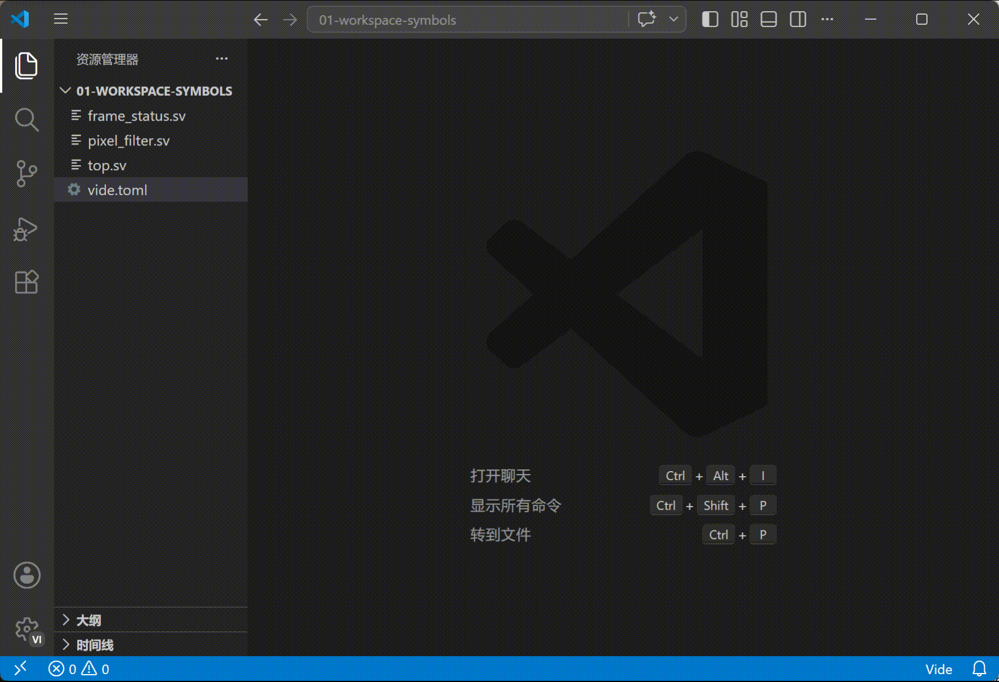
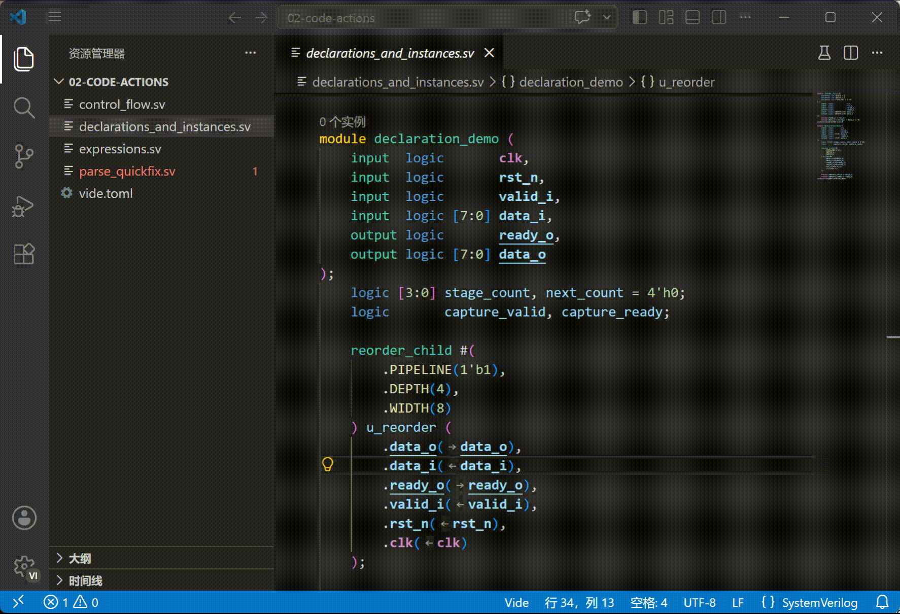
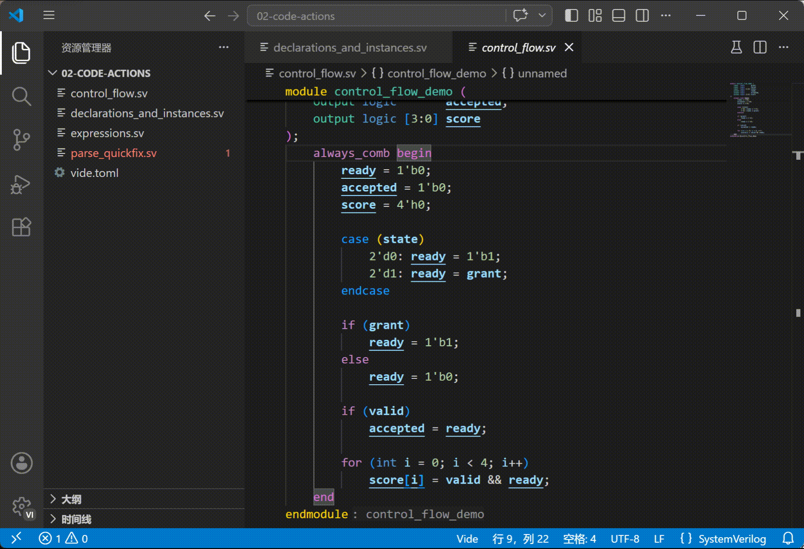
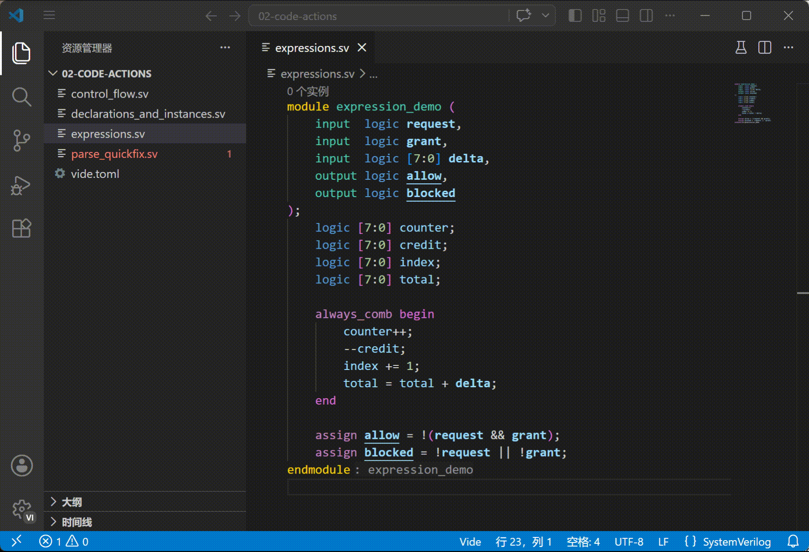
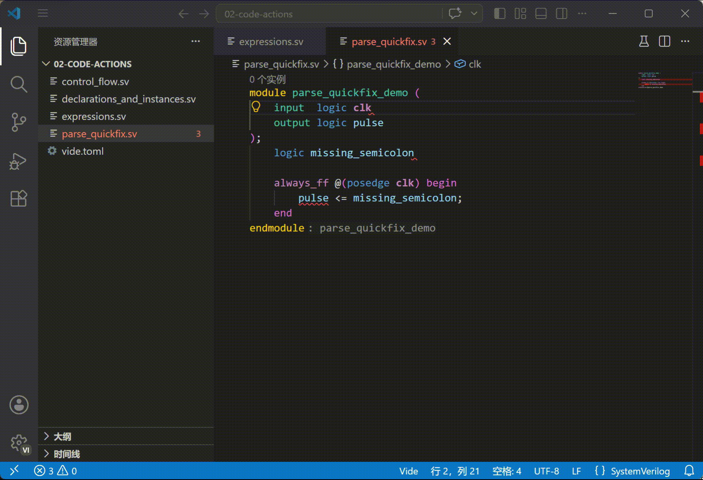
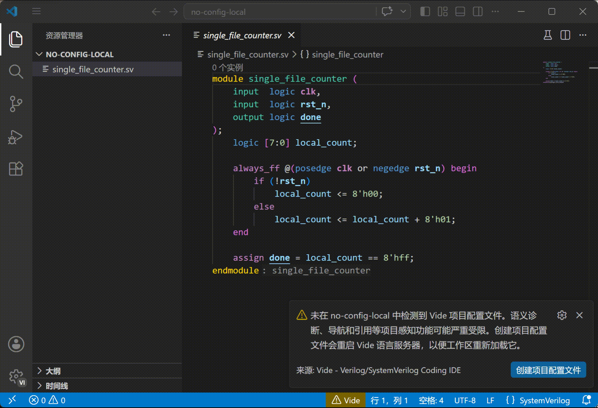
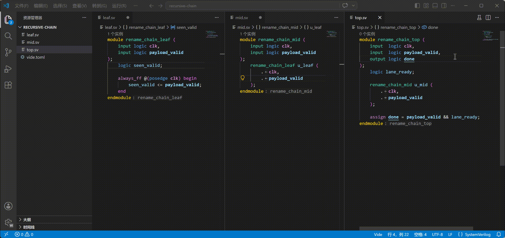
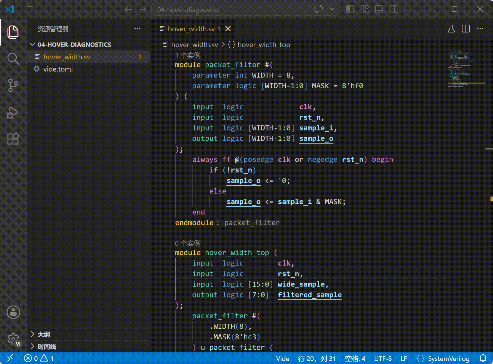

Vide 1.1.0 主要改善写代码时会直接用到的功能：工作区符号搜索、自动重构、重命名、悬停信息和实时诊断。VS Code 用户会在符号搜索、灯泡菜单、重命名、悬停和 Problems 面板里看到这些更新；Neovim、Emacs 等编辑器会在各自已有的符号搜索、代码动作、重命名、悬停和诊断入口里显示。

## 重点更新

### 工作区符号搜索

- 编辑器现在可以向 Vide 查询整个工作区的符号，用于快速搜索模块、实例、信号等代码对象。支持的编辑器会在“工作区符号”或类似入口里显示这些结果。 ([#210](https://github.com/pascal-lab/vide/pull/210))
- 搜索支持大小写不敏感的模糊匹配，也可以用路径或容器名缩小范围，例如先限定模块或层级，再查具体信号。 ([#210](https://github.com/pascal-lab/vide/pull/210))
- 文件在工作区里改名后，工作区符号搜索和跳转定义会更新到新文件路径，不再继续显示或跳转到旧路径。 ([#222](https://github.com/pascal-lab/vide/pull/222))

  

### 自动重构和快速修复

在 VS Code 里，它们通常出现在灯泡菜单；在其他编辑器里，可以从代码动作或 Code Action 入口调用。更多用法见[自动重构文档](../../user-guide/features/quick-fixes/)。

- 声明和实例化整理：`拆分声明`、`排序命名参数赋值`、`排序命名端口连接`。 ([#211](https://github.com/pascal-lab/vide/pull/211))

  

- 控制流整理：`添加 default case 分支项`、`反转 if/else`、`用 begin/end 包裹语句`。 ([#211](https://github.com/pascal-lab/vide/pull/211))

  

- 布尔表达式和复合赋值整理：`应用德摩根律`、`提取德摩根律`、`展开复合赋值`、`折叠复合赋值`。 ([#211](https://github.com/pascal-lab/vide/pull/211))
- 自增、自减、赋值和复合赋值可以互相转换，方便把表达式整理成当前代码更适合的写法。 ([#211](https://github.com/pascal-lab/vide/pull/211))

  

- 解析错误快速修复：缺少括号、分号等语法 token 时，可以直接执行 `插入缺失的 '{token}'`。 ([#212](https://github.com/pascal-lab/vide/pull/212))

  

### 重命名

这些更新会出现在编辑器的重命名功能里。

- 没有 `vide.toml` 时，只要 Vide 能确认改动不会跨出当前文件，也可以直接执行重命名。 ([#202](https://github.com/pascal-lab/vide/pull/202))

  

- 重命名可以递归展开更多相关引用，并在发现重复名称时提醒用户确认风险。 ([#215](https://github.com/pascal-lab/vide/pull/215))

  

### 悬停信息

- 查看模块实例时，悬停信息会显示更完整的模块签名。 ([#209](https://github.com/pascal-lab/vide/pull/209))

### 诊断

- 位宽相关 warning 现在默认开启。升级后，Problems 面板或对应诊断列表里可能会多出宽度扩展、截断提示；如果不想看这些提示，可以调整 `diagnostics.slang.warnings`。 ([#214](https://github.com/pascal-lab/vide/pull/214))

  

## VS Code 扩展

- Windows 上 VS Code 扩展默认使用 `qihe.bat` 启动 Qihe。用户显式配置的命令仍然优先。 ([#207](https://github.com/pascal-lab/vide/pull/207))

## 配置和发布包

- 用户配置 schema 现在会随文档发布，编辑器和文档里的配置说明保持同步。 ([#206](https://github.com/pascal-lab/vide/pull/206))
- Linux x64 发布包改用 manylinux2014 构建，对旧一些的 glibc 环境更友好。 ([#219](https://github.com/pascal-lab/vide/pull/219))

## 文档站点

- 语言切换器显示为“语言/Languages”，并按 label 内容决定宽度，减少中英文切换时的挤压。 ([#216](https://github.com/pascal-lab/vide/pull/216), [#217](https://github.com/pascal-lab/vide/pull/217))
