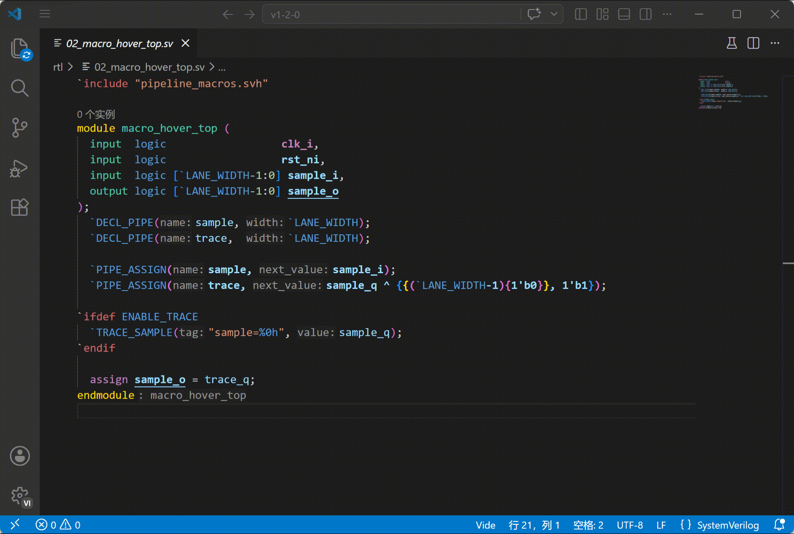
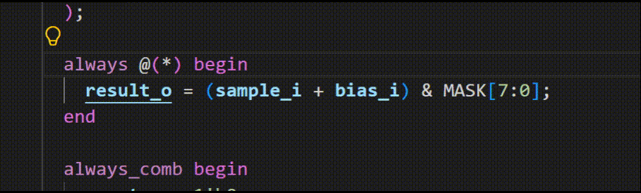
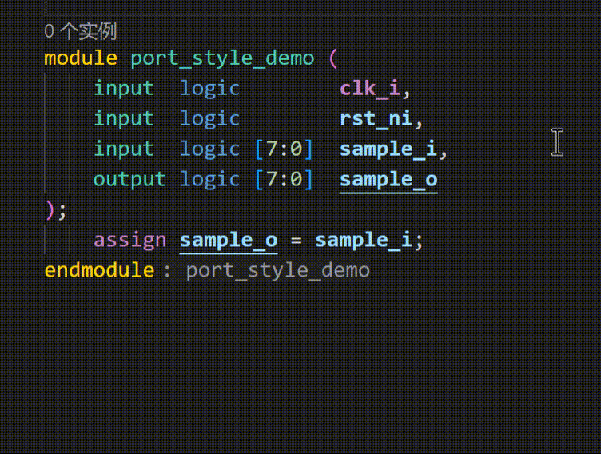
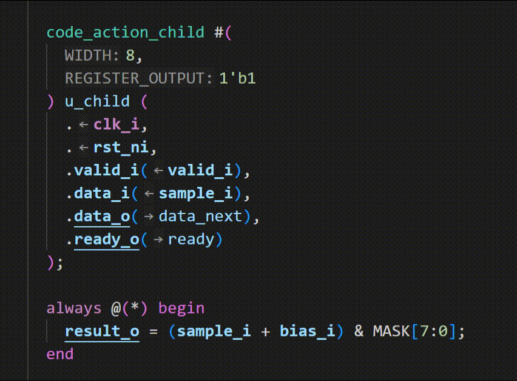
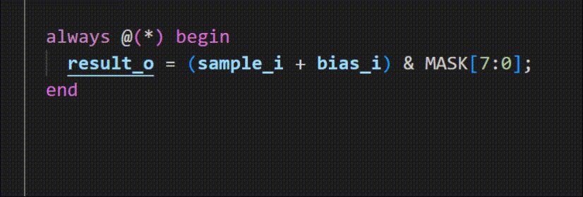
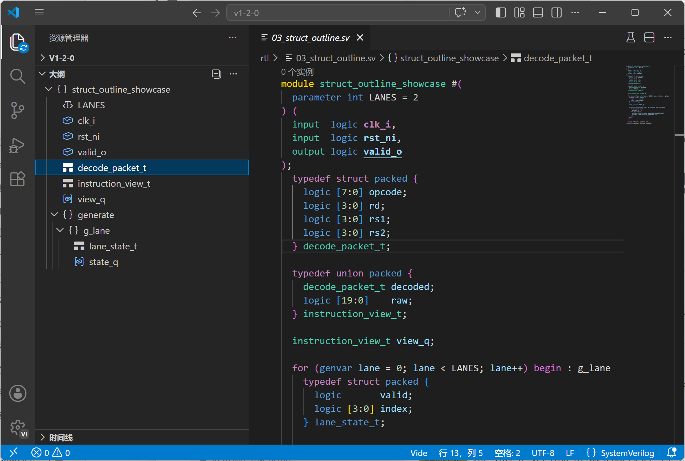

Vide 1.2.0 improves macro navigation, hover, references, and code actions, while adding Qihe options generation and release packaging updates.

## Highlights

### Reading Macros and Conditional Code

- When reading a macro call, hover can now show the macro signature, argument mapping, final expansion text, and each nested expansion step. ([#237](https://github.com/pascal-lab/vide/pull/237) by [@hongjr03](https://github.com/hongjr03))

  

- Macros are no longer limited to the current file: macros defined in included headers can participate in go to definition, find references, hover, completion, and diagnostic targeting. ([#228](https://github.com/pascal-lab/vide/pull/228) by [@hongjr03](https://github.com/hongjr03), [#235](https://github.com/pascal-lab/vide/pull/235) by [@hongjr03](https://github.com/hongjr03))
- Predefined macros from `vide.toml` can be navigation and reference targets when Vide can locate the matching configuration entry. ([#238](https://github.com/pascal-lab/vide/pull/238) by [@hongjr03](https://github.com/hongjr03))
- For the same `ifdef` / `ifndef` code, diagnostics, navigation, semantic tokens, document highlights, and references now agree more consistently on the active branch. ([#234](https://github.com/pascal-lab/vide/pull/234) by [@hongjr03](https://github.com/hongjr03), [#241](https://github.com/pascal-lab/vide/pull/241) by [@hongjr03](https://github.com/hongjr03))

### Code Actions and Document Symbols

- More Code Actions are available: `always` / `always_comb` / `always_ff` conversion, ANSI / non-ANSI port declaration conversion, named-port shorthand expansion/collapse, redundant-parentheses removal, nested-`if` merge, variable extraction, conversion between `if` statements and conditional expressions (`?:`), number-literal reformatting, and more. ([#239](https://github.com/pascal-lab/vide/pull/239) by [@roife](https://github.com/roife))

  

  

  

  

- Document symbols now include `typedef struct` / `typedef union`, including types nested inside generate or block scopes. ([#239](https://github.com/pascal-lab/vide/pull/239) by [@roife](https://github.com/roife))

  

### Qihe Integration

- The VS Code extension can detect `qihe-options.toml` and automatically add `--options ./qihe-options.toml` when running Qihe. `storage.root` from the options file is preserved. ([#226](https://github.com/pascal-lab/vide/pull/226) by [@edragain2nd](https://github.com/edragain2nd))
- A new VS Code command can generate `qihe-options.toml`, reusing the current Qihe command setting, with English and Chinese docs for the workflow. ([#230](https://github.com/pascal-lab/vide/pull/230) by [@hongjr03](https://github.com/hongjr03))

### Reliability, CI, and Packages

- Fixed a crash that could happen in some workspace requests after files were renamed or added. ([#229](https://github.com/pascal-lab/vide/pull/229) by [@hongjr03](https://github.com/hongjr03))
- Fixed C++ / musl linking issues in Alpine packages. ([#232](https://github.com/pascal-lab/vide/pull/232) by [@hongjr03](https://github.com/hongjr03))
- VS Code Web Smoke dependencies moved into a separate package, so regular extension installs and package jobs no longer trigger browser download scripts. ([#231](https://github.com/pascal-lab/vide/pull/231) by [@hongjr03](https://github.com/hongjr03))
- VS Code extension packaging was reorganized, making release packages smaller. Profiling support stays available in debug/profile packages. ([#240](https://github.com/pascal-lab/vide/pull/240) by [@roife](https://github.com/roife))
- Preprocessor code was reorganized into a clearer module boundary for future maintenance. ([#227](https://github.com/pascal-lab/vide/pull/227) by [@hongjr03](https://github.com/hongjr03))

## Contributors

Thanks to everyone who contributed to this release:

- [@edragain2nd](https://github.com/edragain2nd)
- [@hongjr03](https://github.com/hongjr03)
- [@roife](https://github.com/roife)

## New Contributors

- [@edragain2nd](https://github.com/edragain2nd) made their first contribution in [#226](https://github.com/pascal-lab/vide/pull/226).

**Full Changelog**: [v1.1.0...v1.2.0](https://github.com/pascal-lab/vide/compare/v1.1.0...v1.2.0)
